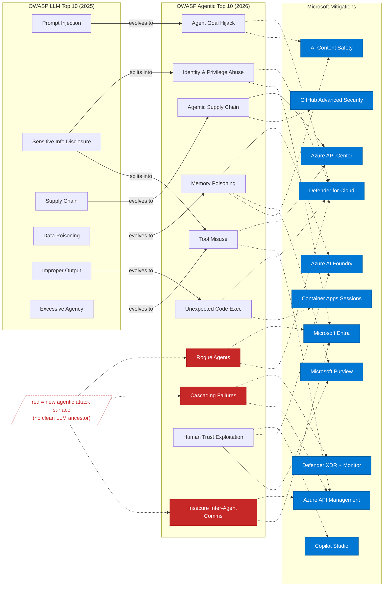

# OWASP LLM Top 10 vs Agentic AI Top 10 — with Microsoft Mitigations

Personal reference: mapping the OWASP Top 10 for LLM Applications (2025) against the newer Top 10 for Agentic Applications (2026), with relevant Microsoft tooling for each agentic risk.

> The Agentic list **complements** (not replaces) the LLM list. The LLM Top 10 secures a single model's inputs/outputs; the Agentic Top 10 secures autonomous **systems** that plan, use tools, have memory, and communicate with other agents.

## Architecture

> **Red** = new attack surfaces with no direct LLM equivalent. **Blue** = Microsoft mitigation tooling. Solid arrows show risk evolution; dotted arrows show primary mitigations (see table below for full mapping). Hover over any node for a one-liner description.

## Comparison Table

> 🎬 **New:** each threat has a 60-second explainer video. Click the 🎬 link in each row to play, or [browse all 10 on the microsite](https://adstuart.github.io/owasp-agentic-reference/).
>
> ⚠️ **Architectural caveat — read this before applying any of the below:** in Azure AI Foundry the **resource is the data-plane security boundary, not the project**. Co-locating workloads in one Foundry resource forfeits least-privilege between them. For regulated workloads, deploy **one Foundry resource per business unit / sensitivity zone**. See [`adstuart/azure-foundry-governance`](https://github.com/adstuart/azure-foundry-governance) for the full reasoning.
>
> ᴾ = preview / early-GA at time of writing (April 2026). Validate availability in your tenant before designing around it.

| # | LLM Top 10 (2025) | Agentic AI Top 10 (2026) | Microsoft Mitigation Tooling | 🎬 |
|---|---|---|---|---|
| 1 | Prompt Injection | **Agent Goal Hijack (ASI01)** — prompt injection but the agent autonomously chains actions on it | **[Azure AI Content Safety — Prompt Shields](https://learn.microsoft.com/en-us/azure/ai-services/content-safety/concepts/jailbreak-detection)** (direct + indirect injection detection, including Spotlighting for RAG scenarios), **[Foundry safety evaluators](https://learn.microsoft.com/en-us/azure/ai-foundry/concepts/evaluation-evaluators/risk-safety-evaluators)** (`indirect_attack`, `jailbreak`, `protected_material` — pre-prod adversarial testing), **[Defender for Cloud AI Threat Protection](https://learn.microsoft.com/en-us/azure/defender-for-cloud/ai-threat-protection)** (runtime jailbreak/anomaly detection), [Microsoft AI Red Team guidance](https://learn.microsoft.com/en-us/security/ai-red-team/) for adversarial-testing methodology | [▶](https://adstuart.github.io/owasp-agentic-reference/#asi01) |
| 2 | Sensitive Information Disclosure | **Tool Misuse & Exploitation (ASI02)** — agents abuse authorised tools (APIs, file systems, email) in unintended ways | **[Microsoft Entra ID](https://learn.microsoft.com/en-us/entra/identity/conditional-access/workload-identity)** (Conditional Access), **[Azure API Management](https://learn.microsoft.com/en-us/azure/api-management/genai-gateway-capabilities)** (request validation, rate limiting, policy enforcement), **[Purview DLP](https://learn.microsoft.com/en-us/purview/dlp-learn-about-dlp)** (prevent agents exfiltrating sensitive data via authorised tools), **[Azure API Center](https://learn.microsoft.com/en-us/azure/api-center/agent-to-agent-overview)** (AI Registry — only approved tools are discoverable/consumable by agents) | [▶](https://adstuart.github.io/owasp-agentic-reference/#asi02) |
| 3 | Supply Chain Vulnerabilities | **Identity & Privilege Abuse (ASI03)** — agents inherit/escalate privileges via tokens, sessions, keys | **[Microsoft Entra Agent ID](https://learn.microsoft.com/en-us/entra/agent-id/agent-identities)** (unique auditable identity per agent), **[Entra Workload ID](https://learn.microsoft.com/en-us/entra/id-protection/concept-workload-identity-risk)** + Conditional Access, **Conditional Access for agentsᴾ** (agent-specific scoping, block, and agent risk policies — narrower than user CA), **[Defender for Cloud CIEM](https://learn.microsoft.com/en-us/azure/defender-for-cloud/permissions-management)** (detect over-privileged agent identities), **[Entra ID Governance access packages](https://learn.microsoft.com/en-us/entra/id-governance/entitlement-management-overview)** (time-bound agent permissions with auto-expiration and review), **[APIM per-model access control](https://learn.microsoft.com/en-us/azure/api-management/genai-gateway-capabilities)** (gateway enforces which models each agent/use-case is authorised to call — unauthorised model requests return 403) | [▶](https://adstuart.github.io/owasp-agentic-reference/#asi03) |
| 4 | Data & Model Poisoning | **Agentic Supply Chain (ASI04)** — compromised plugins, MCP servers, orchestration layers | **[Defender for Cloud AI-SPM](https://learn.microsoft.com/en-us/azure/defender-for-cloud/ai-security-posture)** (attack-path analysis across AI supply chain), **[GitHub Advanced Security](https://docs.github.com/en/code-security/concepts/supply-chain-security/about-supply-chain-security)** (dependency scanning, secret scanning on agent code), **[Azure API Center](https://learn.microsoft.com/en-us/azure/api-center/agent-to-agent-overview)** (AI Registry — vetted catalog of approved MCP servers, plugins, and tools), **[APIM as MCP gateway](https://learn.microsoft.com/en-us/azure/api-management/mcp-server-overview)** (policy enforcement, throttling, and auth on MCP tool calls — agents access MCP servers through the gateway rather than directly, enabling per-tool access control and monitoring) | [▶](https://adstuart.github.io/owasp-agentic-reference/#asi04) |
| 5 | Improper Output Handling | **Unexpected Code Execution (ASI05)** — agents generate and run code, risking RCE / sandbox escape | **[Azure Container Apps Dynamic Sessions](https://learn.microsoft.com/en-us/azure/container-apps/sessions-code-interpreter)** (Hyper-V isolated sandbox — **caveat:** sessions can call out unless the session subnet has explicit NSG/Firewall egress restrictions; ungated egress is the most common misconfiguration in this row), **[Defender for Containers](https://learn.microsoft.com/en-us/azure/defender-for-cloud/defender-for-containers-introduction)** (runtime threat detection inside the sandbox host), **[Defender for Cloud](https://learn.microsoft.com/en-us/azure/defender-for-cloud/alerts-reference)** runtime alerts on the surrounding compute | [▶](https://adstuart.github.io/owasp-agentic-reference/#asi05) |
| 6 | Excessive Agency | **Memory & Context Poisoning (ASI06)** — persistent memory (RAG, vector stores) gets poisoned with malicious data | **Prevent at the source:** **[Purview Data Security Posture Management for AI](https://learn.microsoft.com/en-us/purview/ai-microsoft-purview)** (scan RAG sources for sensitivity / over-permission *before* embedding), **[Purview Information Protection](https://learn.microsoft.com/en-us/purview/sensitivity-labels)** sensitivity labels + **[Purview DLP](https://learn.microsoft.com/en-us/purview/dlp-learn-about-dlp)** on RAG ingestion, **document-level ACLs honoured at retrieval** (Azure AI Search role-based filtering / SharePoint trim). **Detect downstream:** **[Azure AI Content Safety — Groundedness Detection](https://learn.microsoft.com/en-us/azure/ai-services/content-safety/concepts/groundedness)**, **[Foundry Evaluations](https://learn.microsoft.com/en-us/azure/ai-foundry/how-to/evaluate-generative-ai-app)** (`groundedness_pro`, drift detection over time). Don't forget **semantic-cache poisoning** as a sub-threat (APIM semantic cache / Azure Managed Redis can be poisoned via low-trust query paths) | [▶](https://adstuart.github.io/owasp-agentic-reference/#asi06) |
| 7 | *(no clean LLM ancestor — closest analogue: System Prompt Leakage)* | **Insecure Inter-Agent Communication (ASI07)** — spoofing, replay, agent-in-the-middle attacks between agents (a new attack surface in the A2A era) | **[Entra Agent ID](https://learn.microsoft.com/en-us/entra/agent-id/agent-identities)** (mutual authentication between agents — *and* MCP servers themselves should hold an Entra Agent ID, not just consumer agents), **[Azure API Management](https://learn.microsoft.com/en-us/azure/api-management/genai-gateway-capabilities)** (mTLS, JWT validation on inter-agent calls — note: APIM Credential Manager only brokers OAuth2 for tools APIM is in front of, so position APIM as the MCP gateway first), **[APIM Credential Manager](https://learn.microsoft.com/en-us/azure/api-management/credentials-overview)** (gateway brokers OAuth2 to downstream services on behalf of agents), **[Azure Service Bus](https://learn.microsoft.com/en-us/azure/service-bus-messaging/service-bus-authentication-and-authorization)** (authenticated messaging), **[Private endpoints + NSGs](https://learn.microsoft.com/en-us/azure/cloud-adoption-framework/ai/platform/networking)** (network-level isolation — inter-agent traffic stays off public networks) | [▶](https://adstuart.github.io/owasp-agentic-reference/#asi07) |
| 8 | *(no clean LLM ancestor — closest analogue: Vector & Embedding Weaknesses, but those map more naturally to ASI06)* | **Cascading Failures (ASI08)** — one bad input propagates across interconnected agent systems (a new system-property risk, not a model-property risk) | **[Azure API Management](https://learn.microsoft.com/en-us/azure/api-management/genai-gateway-capabilities)** (circuit-breaker policies, retry/back-off), **[Foundry tracing / OpenTelemetry](https://learn.microsoft.com/en-us/azure/ai-foundry/how-to/develop/trace-application)** + **[Foundry observability](https://learn.microsoft.com/en-us/azure/ai-foundry/concepts/observability)** (distributed tracing across multi-agent calls — App Insights alone is incomplete), **[Defender XDR](https://learn.microsoft.com/en-us/defender-xdr/alerts-incidents-correlation)** + **Microsoft Sentinel Graphᴾ / Sentinel MCP serverᴾ** (cross-agent attack-path reasoning), **[Azure Chaos Studio](https://learn.microsoft.com/en-us/azure/chaos-studio/chaos-studio-chaos-experiments)** (resilience testing of agent chains) | [▶](https://adstuart.github.io/owasp-agentic-reference/#asi08) |
| 9 | Misinformation | **Human-Agent Trust Exploitation (ASI09)** — users overtrust agent outputs, enabling social engineering | **[Azure AI Content Safety](https://learn.microsoft.com/en-us/azure/ai-services/content-safety/concepts/harm-categories)** (harm categories for manipulative content), **[Purview Audit](https://learn.microsoft.com/en-us/purview/audit-solutions-overview)** (audit trails on agent-initiated actions), human-in-the-loop patterns in **[Copilot Studio](https://learn.microsoft.com/en-us/microsoft-copilot-studio/flows-request-for-information)**, **[Azure AI Foundry Evaluations](https://learn.microsoft.com/en-us/azure/foundry/how-to/evaluate-generative-ai-app)** (relevance, coherence, completeness metrics — catches plausible-but-wrong answers that enable overtrust) | [▶](https://adstuart.github.io/owasp-agentic-reference/#asi09) |
| 10 | Unbounded Consumption | **Rogue Agents (ASI10)** — agents escape guardrails, self-replicate, or act outside boundaries | **[Defender for Cloud AI threat protection](https://learn.microsoft.com/en-us/azure/defender-for-cloud/ai-threat-protection)** (15+ detection types), **[Entra Agent ID lifecycle + shadow agent discovery](https://learn.microsoft.com/en-us/entra/id-governance/agent-id-governance-overview)**, **Microsoft Agent 365ᴾ** (M365 control plane for AI agents — RSAC 2026 announcement, GA May 2026; the M365-layer answer to rogue-agent governance), **[Entra Internet Access (SSE)](https://learn.microsoft.com/en-us/entra/global-secure-access/concept-internet-access)** for shadow-AI egress blocking, **[APIM quotas](https://learn.microsoft.com/en-us/azure/api-management/genai-gateway-capabilities)** + **[Azure Cost Management](https://learn.microsoft.com/en-us/azure/cost-management-billing/costs/cost-mgt-alerts-monitor-usage-spending) token-charging alerts** + APIM chargeback dashboards (anomalous per-use-case token spikes are an early rogue-agent signal), **[Foundry Control Plane fleet operations](https://learn.microsoft.com/en-us/azure/foundry/control-plane/overview)** (fleet visibility — overlaps with Agent 365 at the M365 layer; pick one canonical surface per estate) | [▶](https://adstuart.github.io/owasp-agentic-reference/#asi10) |

## Key Takeaways

- **New attack surfaces with no clean LLM ancestor**: Inter-agent communication (ASI07), cascading failures (ASI08), and rogue agents (ASI10). The table now reflects this — rows 7 and 8 list the *closest analogue* from the LLM list rather than implying evolution.
- **Evolution of existing risks**: Prompt Injection → Goal Hijack (now the agent *acts* on it). Excessive Agency → Tool Misuse + Identity Abuse (more granular). Data Poisoning → Memory/Context Poisoning (persistent RAG stores).
- **Microsoft's defence-in-depth** spans identity (Entra Agent ID), data governance (Purview), runtime protection (Defender for Cloud), content filtering (AI Content Safety), API control (APIM), pre-prod testing (Foundry safety evaluators), and operational telemetry (Foundry tracing, Sentinel correlation).
- **Architectural prerequisite**: the Foundry resource is the data-plane security boundary — designing agent isolation at the project level is a common and dangerous mistake. See the callout above the table.
- **Scope of this reference**: this is a Microsoft-centric control map. For non-Microsoft agents, third-party MCP servers, or hybrid stacks you'll still need vendor-native equivalents for protocol-level auth, audit logging, and governance — Microsoft tooling does not replace them.

## References

- [OWASP Top 10 for Agentic Applications (2026)](https://genai.owasp.org/resource/owasp-top-10-for-agentic-applications-for-2026/)
- [OWASP Top 10 for LLM Applications (2025)](https://genai.owasp.org/resource/owasp-top-10-for-llm-applications-2025/)
- [OWASP GenAI Security Project — Agentic Security Initiative](https://genai.owasp.org/initiatives/agentic-security-initiative/)
- [OWASP Announcement — Dec 2025](https://genai.owasp.org/2025/12/09/owasp-genai-security-project-releases-top-10-risks-and-mitigations-for-agentic-ai-security/)
- [Microsoft Defender for Cloud — AI threat protection](https://learn.microsoft.com/en-us/azure/defender-for-cloud/ai-threat-protection)
- [Azure AI Content Safety — Prompt Shields](https://learn.microsoft.com/en-us/azure/ai-services/content-safety/concepts/jailbreak-detection)
- [Microsoft Entra Agent ID](https://learn.microsoft.com/en-us/entra/agent-id/)

---
> **Footnote — Foundry Citadel**: Many of the APIM-based mitigations above (unified AI gateway, per-model access control, MCP gateway, credential brokering, chargeback dashboards) ship together as a deployable landing zone accelerator called [Foundry Citadel](https://aka.ms/ai-hub-gateway) (citadel-v1 branch). It provides a one-click hub-spoke architecture with centralised governance for LLMs, agents, and tools.

*Last updated: April 2026*
