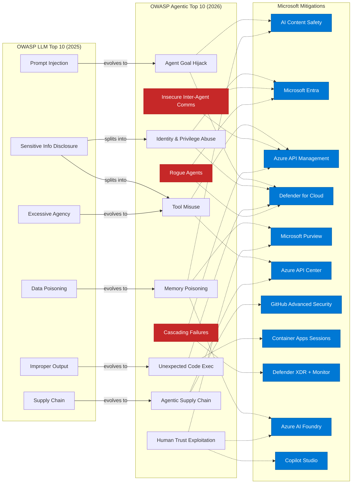

# OWASP LLM Top 10 vs Agentic AI Top 10 — with Microsoft Mitigations

Personal reference: mapping the OWASP Top 10 for LLM Applications (2025) against the newer Top 10 for Agentic Applications (2026), with relevant Microsoft tooling for each agentic risk.

> The Agentic list **complements** (not replaces) the LLM list. The LLM Top 10 secures a single model's inputs/outputs; the Agentic Top 10 secures autonomous **systems** that plan, use tools, have memory, and communicate with other agents.

## Architecture

> **Red** = new attack surfaces with no direct LLM equivalent. **Blue** = Microsoft mitigation tooling. Solid arrows show risk evolution; dotted arrows show primary mitigations (see table below for full mapping). Hover over any node for a one-liner description.

## Comparison Table

> 🎬 **New:** each threat below has a 60-second explainer video. Click the 🎬 link in each row to jump to the embedded player, or browse all videos in the [Threat Videos](#threat-videos) section.

| # | LLM Top 10 (2025) | Agentic AI Top 10 (2026) | Microsoft Mitigation Tooling | 🎬 |
|---|---|---|---|---|
| 1 | Prompt Injection | **Agent Goal Hijack (ASI01)** — prompt injection but the agent autonomously chains actions on it | **[Azure AI Content Safety — Prompt Shields](https://learn.microsoft.com/en-us/azure/ai-services/content-safety/concepts/jailbreak-detection)** (direct + indirect injection detection), [Spotlighting](https://learn.microsoft.com/en-us/azure/ai-services/content-safety/concepts/jailbreak-detection) for RAG scenarios, **[Defender for Cloud AI Threat Protection](https://learn.microsoft.com/en-us/azure/defender-for-cloud/ai-threat-protection)** (runtime jailbreak/anomaly detection) | [▶](#asi01) |
| 2 | Sensitive Information Disclosure | **Tool Misuse & Exploitation (ASI02)** — agents abuse authorised tools (APIs, file systems, email) in unintended ways | **[Microsoft Entra ID](https://learn.microsoft.com/en-us/entra/identity/conditional-access/workload-identity)** (Conditional Access), **[Azure API Management](https://learn.microsoft.com/en-us/azure/api-management/genai-gateway-capabilities)** (request validation, rate limiting, policy enforcement), **[Purview DLP](https://learn.microsoft.com/en-us/purview/dlp-learn-about-dlp)** (prevent agents exfiltrating sensitive data via authorised tools), **[Azure API Center](https://learn.microsoft.com/en-us/azure/api-center/agent-to-agent-overview)** (AI Registry — only approved tools are discoverable/consumable by agents) | [▶](#asi02) |
| 3 | Supply Chain Vulnerabilities | **Identity & Privilege Abuse (ASI03)** — agents inherit/escalate privileges via tokens, sessions, keys | **[Microsoft Entra Agent ID](https://learn.microsoft.com/en-us/entra/agent-id/identity-platform/agent-identities)** (unique auditable identity per agent), **[Entra Workload ID](https://learn.microsoft.com/en-us/entra/id-protection/concept-workload-identity-risk)** + Conditional Access, **[Defender for Cloud CIEM](https://learn.microsoft.com/en-us/azure/defender-for-cloud/permissions-management)** (detect over-privileged agent identities), **[Entra ID Governance access packages](https://learn.microsoft.com/en-us/entra/id-governance/entitlement-management-overview)** (time-bound agent permissions with auto-expiration and review), **[APIM per-model access control](https://learn.microsoft.com/en-us/azure/api-management/genai-gateway-capabilities)** (gateway enforces which models each agent/use-case is authorised to call — unauthorised model requests return 403) | [▶](#asi03) |
| 4 | Data & Model Poisoning | **Agentic Supply Chain (ASI04)** — compromised plugins, MCP servers, orchestration layers | **[Defender for Cloud AI-SPM](https://learn.microsoft.com/en-us/azure/defender-for-cloud/ai-security-posture)** (attack-path analysis across AI supply chain), **[GitHub Advanced Security](https://docs.github.com/en/code-security/concepts/supply-chain-security/about-supply-chain-security)** (dependency scanning, secret scanning on agent code), **[Azure API Center](https://learn.microsoft.com/en-us/azure/api-center/agent-to-agent-overview)** (AI Registry — vetted catalog of approved MCP servers, plugins, and tools), **[APIM as MCP gateway](https://learn.microsoft.com/en-us/azure/api-management/expose-api-as-mcp-tool)** (policy enforcement, throttling, and auth on MCP tool calls — agents access MCP servers through the gateway rather than directly, enabling per-tool access control and monitoring) | [▶](#asi04) |
| 5 | Improper Output Handling | **Unexpected Code Execution (ASI05)** — agents generate and run code, risking RCE / sandbox escape | **[Azure Container Apps Dynamic Sessions](https://learn.microsoft.com/en-us/azure/container-apps/sessions-code-interpreter)** (sandboxed code execution), **[Defender for Cloud](https://learn.microsoft.com/en-us/azure/defender-for-cloud/alerts-reference)** runtime threat detection on compute | [▶](#asi05) |
| 6 | Excessive Agency | **Memory & Context Poisoning (ASI06)** — persistent memory (RAG, vector stores) gets poisoned with malicious data | **[Azure AI Content Safety — Groundedness Detection](https://learn.microsoft.com/en-us/azure/ai-services/content-safety/concepts/groundedness)**, **[Purview Information Protection](https://learn.microsoft.com/en-us/purview/sensitivity-labels)** (sensitivity labels on documents entering RAG pipelines), **[Purview DLP](https://learn.microsoft.com/en-us/purview/dlp-learn-about-dlp)** on RAG store ingestion, **[Azure AI Foundry Evaluations](https://learn.microsoft.com/en-us/azure/foundry/how-to/evaluate-generative-ai-app)** (automated batch groundedness scoring — detects RAG output drift from poisoned sources over time) | [▶](#asi06) |
| 7 | System Prompt Leakage | **Insecure Inter-Agent Communication (ASI07)** — spoofing, replay, agent-in-the-middle attacks between agents | **[Entra Agent ID](https://learn.microsoft.com/en-us/entra/agent-id/identity-platform/agent-identities)** (mutual authentication between agents), **[Azure API Management](https://learn.microsoft.com/en-us/azure/api-management/genai-gateway-capabilities)** (mTLS, JWT validation on inter-agent calls), **[APIM Credential Manager](https://learn.microsoft.com/en-us/azure/api-management/credentials-overview)** (gateway brokers OAuth2 flows to downstream services on behalf of agents — agents never hold third-party credentials directly), **[Azure Service Bus](https://learn.microsoft.com/en-us/azure/service-bus-messaging/service-bus-authentication-and-authorization)** (authenticated messaging), **[Private endpoints + NSGs](https://learn.microsoft.com/en-us/azure/cloud-adoption-framework/scenarios/ai/platform/networking)** (network-level isolation — inter-agent traffic stays off public networks) | [▶](#asi07) |
| 8 | Vector & Embedding Weaknesses | **Cascading Failures (ASI08)** — one bad input propagates across interconnected agent systems | **[Azure API Management](https://learn.microsoft.com/en-us/azure/api-management/genai-gateway-capabilities)** (circuit-breaker policies, retry/back-off), **[Defender XDR](https://learn.microsoft.com/en-us/defender-xdr/alerts-incidents-correlation)** (correlated detection across agent workflows), **[Azure Monitor + App Insights](https://learn.microsoft.com/en-us/azure/azure-monitor/app/agents-view)**, **[Azure Chaos Studio](https://learn.microsoft.com/en-us/azure/chaos-studio/chaos-studio-chaos-experiments)** (resilience testing of agent chains) | [▶](#asi08) |
| 9 | Misinformation | **Human-Agent Trust Exploitation (ASI09)** — users overtrust agent outputs, enabling social engineering | **[Azure AI Content Safety](https://learn.microsoft.com/en-us/azure/ai-services/content-safety/concepts/harm-categories)** (harm categories for manipulative content), **[Purview Audit](https://learn.microsoft.com/en-us/purview/audit-solutions-overview)** (audit trails on agent-initiated actions), human-in-the-loop patterns in **[Copilot Studio](https://learn.microsoft.com/en-us/microsoft-copilot-studio/flows-request-for-information)**, **[Azure AI Foundry Evaluations](https://learn.microsoft.com/en-us/azure/foundry/how-to/evaluate-generative-ai-app)** (relevance, coherence, completeness metrics — catches plausible-but-wrong answers that enable overtrust) | [▶](#asi09) |
| 10 | Unbounded Consumption | **Rogue Agents (ASI10)** — agents escape guardrails, self-replicate, or act outside boundaries | **[Defender for Cloud AI threat protection](https://learn.microsoft.com/en-us/azure/defender-for-cloud/ai-threat-protection)** (15+ detection types), **[Entra Agent ID lifecycle management](https://learn.microsoft.com/en-us/entra/id-governance/agent-id-governance-overview)**, **[APIM quotas](https://learn.microsoft.com/en-us/azure/api-management/genai-gateway-capabilities)**, **[Azure Cost Management](https://learn.microsoft.com/en-us/azure/cost-management-billing/costs/cost-mgt-alerts-monitor-usage-spending) + token-based charging alerts** (detect runaway agent consumption), **APIM chargeback dashboards** (per-use-case token consumption tracking — anomalous spikes in a specific agent's usage serve as an early rogue-agent detection signal), **[Foundry Control Plane fleet operations](https://learn.microsoft.com/en-us/azure/foundry/control-plane/overview)** (agent fleet visibility + behavioural anomaly detection), **[Entra ID shadow agent discovery](https://learn.microsoft.com/en-us/entra/id-governance/agent-id-governance-overview)** (detect unregistered agents) | [▶](#asi10) |

## Threat Videos

Each video is ~60 seconds and covers: the 2025 LLM predecessor → how it evolves in the agentic world → top Microsoft mitigation. Generated with [HyperFrames](https://github.com/heygen-com/hyperframes) and a Custom Neural Voice trained on my own narration — pipeline sources in [`video-pipeline/`](./video-pipeline/).

### ASI01 — Agent Goal Hijack

https://github.com/adstuart/owasp-agentic-reference/raw/master/videos/ASI01.mp4

### ASI02 — Tool Misuse & Exploitation

https://github.com/adstuart/owasp-agentic-reference/raw/master/videos/ASI02.mp4

### ASI03 — Identity & Privilege Abuse

https://github.com/adstuart/owasp-agentic-reference/raw/master/videos/ASI03.mp4

### ASI04 — Agentic Supply Chain

https://github.com/adstuart/owasp-agentic-reference/raw/master/videos/ASI04.mp4

### ASI05 — Unexpected Code Execution

https://github.com/adstuart/owasp-agentic-reference/raw/master/videos/ASI05.mp4

### ASI06 — Memory & Context Poisoning

https://github.com/adstuart/owasp-agentic-reference/raw/master/videos/ASI06.mp4

### ASI07 — Insecure Inter-Agent Communication

https://github.com/adstuart/owasp-agentic-reference/raw/master/videos/ASI07.mp4

### ASI08 — Cascading Failures

https://github.com/adstuart/owasp-agentic-reference/raw/master/videos/ASI08.mp4

### ASI09 — Human-Agent Trust Exploitation

https://github.com/adstuart/owasp-agentic-reference/raw/master/videos/ASI09.mp4

### ASI10 — Rogue Agents

https://github.com/adstuart/owasp-agentic-reference/raw/master/videos/ASI10.mp4

## Key Takeaways

- **New attack surfaces with no LLM equivalent**: Inter-agent communication (ASI07), cascading failures (ASI08), and rogue agents (ASI10).
- **Evolution of existing risks**: Prompt Injection → Goal Hijack (now the agent *acts* on it). Excessive Agency → Tool Misuse + Identity Abuse (more granular). Data Poisoning → Memory/Context Poisoning (persistent RAG stores).
- **Microsoft's defence-in-depth** spans identity (Entra Agent ID), data governance (Purview), runtime protection (Defender for Cloud), content filtering (AI Content Safety), and API control (APIM).

## References

- [OWASP Top 10 for Agentic Applications (2026)](https://genai.owasp.org/resource/owasp-top-10-for-agentic-applications-for-2026/)
- [OWASP Top 10 for LLM Applications (2025)](https://genai.owasp.org/resource/owasp-top-10-for-llm-applications-2025/)
- [OWASP GenAI Security Project — Agentic Security Initiative](https://genai.owasp.org/initiatives/agentic-security-initiative/)
- [OWASP Announcement — Dec 2025](https://genai.owasp.org/2025/12/09/owasp-genai-security-project-releases-top-10-risks-and-mitigations-for-agentic-ai-security/)
- [Microsoft Defender for Cloud — AI threat protection](https://learn.microsoft.com/en-us/azure/defender-for-cloud/ai-threat-protection)
- [Azure AI Content Safety — Prompt Shields](https://learn.microsoft.com/en-us/azure/ai-services/content-safety/concepts/jailbreak-detection)
- [Microsoft Entra Agent ID](https://learn.microsoft.com/en-us/entra/identity/agents/overview)

---
> **Footnote — Foundry Citadel**: Many of the APIM-based mitigations above (unified AI gateway, per-model access control, MCP gateway, credential brokering, chargeback dashboards) ship together as a deployable landing zone accelerator called [Foundry Citadel](https://aka.ms/ai-hub-gateway) (citadel-v1 branch). It provides a one-click hub-spoke architecture with centralised governance for LLMs, agents, and tools.

*Last updated: April 2026*
