# OWASP Agentic Top-10 — Narrated Threat Videos

Ten ~60s narrated explainer videos, one per OWASP Agentic AI Top-10 threat (2026), mapped to their OWASP LLM Top-10 (2025) predecessor and the recommended Microsoft mitigations.

Source material: [adstuart/owasp-agentic-reference](https://github.com/adstuart/owasp-agentic-reference).

## Architecture

```mermaid
flowchart LR
  A[ASI threat<br/>README.md] --> B[Narration<br/>script.txt]
  B --> C[SSML<br/>build_ssml]
  C --> D[CNV V2 direct<br/>managed identity]
  D --> E[narration.wav]
  E --> F[HyperFrames<br/>index.html]
  F --> G[QA pre-check<br/>assets exist]
  G --> H[npx hyperframes render]
  H --> I[threat.mp4]
  I --> J[QA post-check<br/>ffprobe + frame/audio]
  J --> K[Publish<br/>GitHub issue #6]
```



## Layout

- `src/ASI01/` … `src/ASI10/` — one HyperFrames project per threat (index.html, script.txt, audio/narration.wav)
- `shared/theme.css` — shared dark palette + typography
- `scripts/synthesize.py` — CNV V2 SSML synth wrapping `azure_video_factory.cnv_direct`
- `scripts/render_all.py` — pre-check → render → post-check for all 10
- `out/` — rendered MP4s (gitignored)

## Visual identity

- Dark slate background `#0b0f14`
- Microsoft blue accent `#0078d4` for mitigation panels
- Red accent `#c62828` for ASI07 / ASI08 / ASI10 ("new attack surface" threats)
- Typography: IBM Plex Sans (headline, heavy) paired with JetBrains Mono (labels/code)

## Narration

CNV V2 custom voice `AdamStuartV2Neural` via direct managed-identity path (`azure-video-factory/scripts/cnv_direct.py`). Prosody rate `-5%`, pitch `-2%`. Scripts target ~140–160 words → ~60s at rate `-5%`.

## Build

```bash
# 1. Synthesise narration for all 10 threats (requires Azure login on dev box)
python3 scripts/synthesize.py

# 2. Render all 10 videos with QA gates
python3 scripts/render_all.py
```

## HyperFrames gotchas (from James Russo's HeyGen post, Apr 2026)

- No network fetches at render time — fonts and images embedded/local.
- Avoid `<video>` elements with streaming/blob `src` — only static file paths work because HyperFrames pre-extracts frames with ffmpeg.
- Video-heavy compositions may need `--workers 1` to avoid decoder exhaustion.
- These videos are text + narration only (no embedded video clips), so the last two barely apply.

## Decisions

- Upload destination: on first pass we attach MP4s to GitHub issue #6 rather than auto-publishing to YouTube. YouTube is a one-liner follow-up if the user wants it.
- CNV V2 endpoint is $4.04/hr while active — all 10 narrations are synthesised in one session.

## Credits

- Custom voice: Azure AI Speech CNV V2 (`speech-cnv-adam-voice`, deployment `d55b6dc0-…`)
- Rendering: [HyperFrames](https://hyperframes.heygen.com)
- QA gates: `azure-video-factory/scripts/qa_gates.py`
